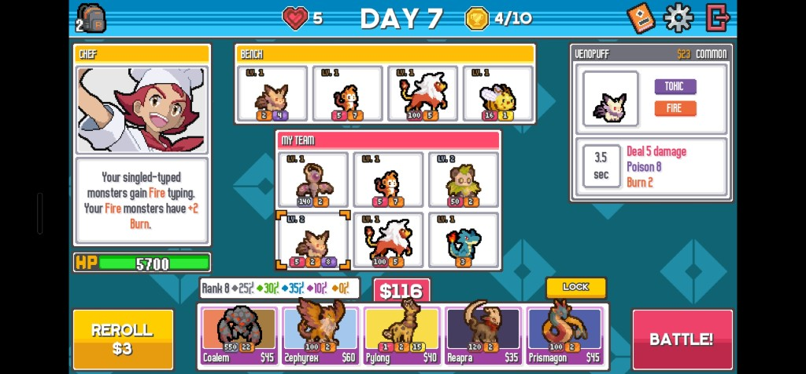

# 003 — The Run Shop and the Game-Shaped Board Layout

**Specification only. Nothing is built.**

Rebuilds the Calculator view around the shape of the game's own shop screen: a five-offer shop row
with prices and rarity, a run economy the advisor can reason about, and a page layout whose regions
match where the game puts them.

## Read in this order

| Document | What it answers |
|---|---|
| [`spec.md`](./spec.md) | What it is: the fork that gates everything, user stories, functional requirements, success criteria |
| [`data-model.md`](./data-model.md) | The run-state systems: economy, shop offers, rarity odds, what persists, what the engine gains |
| [`ui-architecture.md`](./ui-architecture.md) | The layout shell, the DOM/div restructuring, the component inventory, the responsive strategy, the migration sequence |

## The fork that gates everything

**Is the shop transcribed or simulated?** Every other decision hangs off this one.

- **Transcribed** — you tell the app what your real shop is showing, and it prices the choice. No
  random-number generator, no rarity-odds table, no run state machine. The app stays a calculator.
- **Simulated** — the app rolls offers from a rank-weighted odds table and you play a fake run
  inside it. That needs odds data this project does not have, a seeded RNG, and a run loop, and it
  makes the app a game rather than a tool for one.

`spec.md` recommends **transcribed**, with the odds table arriving later as an *advice* input
("rerolling is worth it at this rank") rather than as a generator. The recommendation has an
evidence base: the question that produced this feature was *"I had $55 and four offers, which two
should I have bought?"*, and that question needs no RNG at all.

## The three things that block a start

1. **65 of 149 species carry `shopCost: 0`** — 44% of the corpus is unpriced, and a shop row cannot
   render a price it does not have. See `data-model.md` §4.
2. **Hover is the current selection model.** The detail panel is driven by `onMouseEnter`, which has
   no touch equivalent, and the game's layout puts the detail card where a phone has no room for it.
   A real `selected` model has to land before the layout moves. See `ui-architecture.md` §5.
3. **`DndContext` is owned by `GridPicker`.** The board and the bench are rendered by one component
   because drag-and-drop requires one context; the new layout needs them in different regions, and
   the shop needs to be a drag source into both. The context has to be lifted first. See
   `ui-architecture.md` §3.2.

None of the three is hard. All three are cheaper to do before the layout change than during it.

## What this changes about advice

The bench is currently modelled as monsters you already own, and the lineup search prices them at
zero gold. On a real shop screen that produces unactionable recommendations — on the board that
prompted this feature it advised fielding two monsters costing $75 against a $55 budget.

Making `rosterAdvice` budget-aware is a small, self-contained change with a large payoff, and it is
specified here (FR-S12) rather than deferred, because it is the reason the shop is worth building.

## Relationship to 001

This is a **round of 001**, not a spin-off. It changes `TeamConfiguration`, the engine's advisor and
most of the UI layer, so it belongs to the same feature. It lives in its own folder only because the
document set is large enough that appending it to `001/spec.md`'s amendment log would bury it;
accepted requirements should be folded back into `001/spec.md` as an amendment round when this ships.

`.specify/feature.json` still points at 001, so `/speckit-plan` and `/speckit-tasks` operate on that
directory, not this one.
